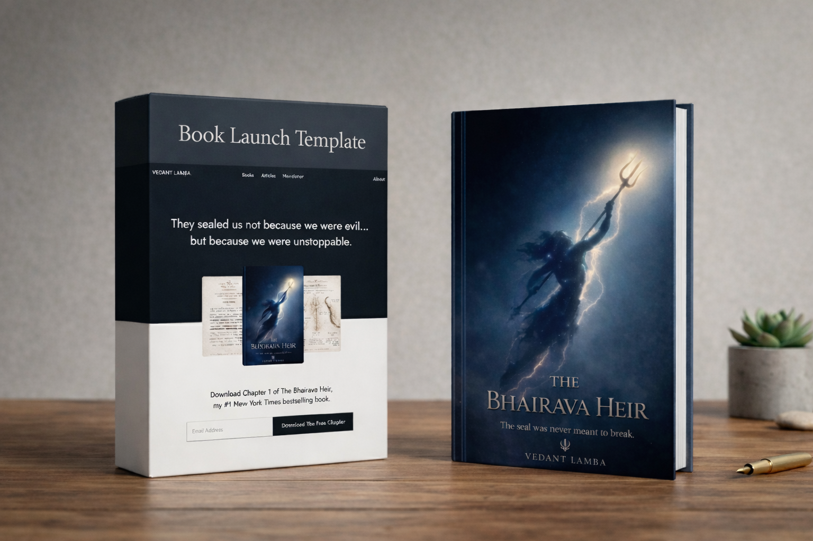

# Author Website Template for Writers and Book Authors



A free, premium-looking author website template built with Next.js for book writers, indie authors, and creators who want a clean online presence for their books, articles, and newsletter.

This project is designed to be friendly for non-technical users too. You can customize most of the website by editing content files instead of touching the whole codebase.

## Live Demo

- Demo: [author-template.vercel.app](https://author-template.vercel.app/)
- Full setup guide: [Read the Medium blog](https://medium.com/@vedantlamba/how-to-build-an-author-website-for-free-even-if-youve-never-touched-code-5039d1ccc91c)

## What This Template Includes

- A polished homepage for your personal brand
- A dedicated books section
- An about page
- MDX-powered article pages
- MDX-powered newsletter pages
- Dynamic article and newsletter listings
- Newsletter signup with MailerLite support
- Social links, author details, and reusable content config
- A beginner-friendly content structure

## Who This Is For

This template is a great fit for:

- authors
- book writers
- indie creators
- newsletter writers
- people building a personal brand around their work

You can also adapt it to promote a course, digital product, or creative project.

## Tech Stack

- Next.js
- TypeScript
- Tailwind CSS
- MDX
- MailerLite

## Getting Started

Clone your copy of the repository and install dependencies:

```bash
git clone https://github.com/your-username/author-portfolio-nextjs.git
cd author-portfolio-nextjs
npm install
npm run dev
```

Then open [http://localhost:3000](http://localhost:3000) in your browser.

## Environment Variables

Create a `.env.local` file and copy the values from `.env.example`.

```bash
MAILERLITE_API_KEY=your-mailerlite-api-key
MAILERLITE_GROUP_NAME=your-group-name
```

Important:

- never commit your real API key to GitHub
- keep your MailerLite token private
- make sure your MailerLite group name matches exactly

## Where To Edit Content

If you want to keep things simple, focus mainly on:

- `content/`
- `lib/content/`
- `public/`
- `app/layout.tsx`

### Main Content Areas

- `content/home/` for homepage copy
- `content/about/` for about-page sections
- `content/articles/entries/` for articles
- `content/newsletter/entries/` for newsletter issues
- `lib/content/` for titles, links, sidebars, images, and shared config
- `public/` for images like author photos, book covers, and icons

## Adding Articles

Each article is an MDX file inside:

```bash
content/articles/entries/
```

Use this as your reference:

```bash
content/articles/example.mdx
```

Each article can define:

- title
- subheading
- author
- category
- tags
- footnotes
- body content

## Adding Newsletter Issues

Each newsletter issue is an MDX file inside:

```bash
content/newsletter/entries/
```

Use this as your reference:

```bash
content/newsletter/example.mdx
```

Each newsletter can define:

- title
- author
- published date
- full newsletter content

## Deployment

The easiest way to deploy is with Vercel.

1. Push your customized version to GitHub
2. Import the repository into Vercel
3. Add your environment variables in Vercel
4. Redeploy

If you are using MailerLite, remember to add the same env values in your Vercel project settings.

## Beginner-Friendly Tip

If you are not technical, you do not need to do everything alone.

Ask tools like Codex, ChatGPT, or Claude for help with prompts like:

> Help me replace the demo content in this file with my own author content.

That one workflow can save you a lot of time.

## Links

- Blog: [How to Build an Author Website for Free, Even If You've Never Touched Code](https://medium.com/@vedantlamba/how-to-build-an-author-website-for-free-even-if-youve-never-touched-code-5039d1ccc91c)
- Portfolio: [vedantlamba.com](https://www.vedantlamba.com)
- Twitter/X: [x.com/Vedantlamba](https://x.com/Vedantlamba)
- Support the project: [buymeacoffee.com/vedantlamba](https://buymeacoffee.com/vedantlamba)

## Support

If this template helped you, consider:

- starring the repository
- sharing it with another writer
- supporting the project through Buy Me a Coffee

---

Built by [Vedant Lamba](https://www.vedantlamba.com)
